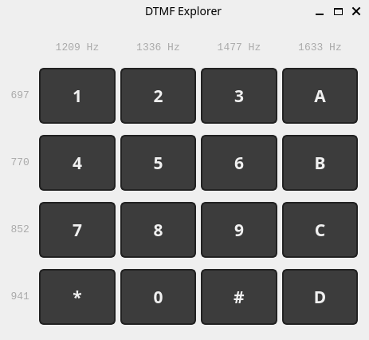

# DTMF Explorer

An interactive DTMF tone explorer for children. Press any key on the 4×4 grid and hear the correct dual-tone audio. The row and column frequencies are always visible, making the two-frequency structure of DTMF immediately apparent.



---

## What is DTMF?

DTMF (Dual-Tone Multi-Frequency) is the signalling system used by telephone keypads. Each key produces a unique sound that is the **sum of two sine waves** — one from its row frequency, one from its column frequency.

```
         1209 Hz  1336 Hz  1477 Hz  1633 Hz
  697 Hz    1        2        3        A
  770 Hz    4        5        6        B
  852 Hz    7        8        9        C
  941 Hz    *        0        #        D
```

Pressing **5** plays 770 Hz + 1336 Hz simultaneously. No pre-recorded audio — every tone is generated in real time from two sine waves.

---

## Features

- 4×4 keypad showing all 16 DTMF keys (standard 12-key phone layout plus A–D)
- Row frequencies labeled on the left; column frequencies across the top
- Tone plays for as long as the key is held — mouse or keyboard
- Clean fade-in/fade-out (8 ms) — no audible click at press or release
- Keyboard support: `0–9`, `*`, `#`, `A–D`
- Audio device error shown as a banner; buttons disabled gracefully

---

## Requirements

- Python 3.13+
- [uv](https://docs.astral.sh/uv/) (package manager)
- A working audio output device
- Linux, macOS, or Windows

---

## Installation

```bash
git clone <repo-url>
cd vibecoding-dtmf
uv sync
```

## Running

```bash
uv run python main.py
```

---

## How it works

### Audio engine (`dtmf/audio.py`)

Tones are generated on the fly using NumPy and played via sounddevice's `OutputStream` callback:

```python
samples = (np.sin(row_phase + n * row_inc) + np.sin(col_phase + n * col_inc)) * 0.4
```

Key design decisions:
- **Phase accumulator** — the sine phase is carried across callback calls to prevent mid-hold discontinuity clicks
- **Linear fade-in/fade-out** — 8 ms ramp prevents click artifacts at press and release
- **Deferred stream close** — after fade-out the stream outputs silence for 50 ms before closing, ensuring the hardware buffer drains fully
- **OS key-repeat guard** — repeated `keydown` events for the same key are ignored

### Keypad UI (`dtmf/ui.py`)

Built with PySide6 (`QWidget` + `QGridLayout`):
- `KeyButton` — `QPushButton` subclass; emits a signal on mouse press
- `KeypadWidget` — manages active state, routes keyboard events, installs a global `QApplication` event filter to catch mouse release anywhere on screen (including outside the button)

---

## Development

```bash
uv run pytest          # run tests
uv run ruff check .    # lint
uv run pyright dtmf/   # type-check
```

The audio engine is fully unit-tested with a mocked sounddevice backend (18 tests). The UI is manually verified.

---

## License

See `LICENSE`.
